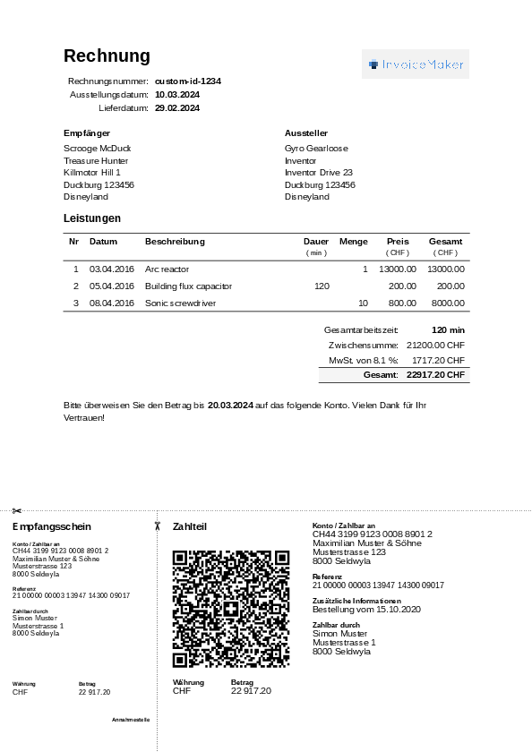

# Invoice Maker

Generate simple, clean invoices with a (optional) swiss invoice QR code.



## Installation & Usage

#TODO

## Parameters

> The QR code section can be removed by not setting any qr_opts.

Almost all of these parameters are optional and include sensible defaults or optional functionality.

```typst
  language: "de", // or "fr", "en" (italian contribution is welcome!)
  currency: "CHF", // CHF, EUR, €
  country: "CH", // used for verifying IBAN
  title: "Rechnung",
  banner-image: image("banner.png", width: 12em),
  invoice-id: "custom-id-1234", // optional, auto-generated with date if not specified
  // cancellation-id: "2024-03-24t210835,  // Uncomment this to create a cancellation invoice
  issuing-date: "2024-03-10",
  delivery-date: "2024-02-29",
  due-date: "2024-03-20",
  vat: 0.081,
  biller: (
    name: "Gyro Gearloose",
    title: "Inventor",
    company: "Crazy Inventions Ltd.",
    iban: "DE89370400440532013000",
    address: (
      country: "Disneyland",
      city: "Duckburg",
      postal-code: "123456",
      street: "Inventor Drive 23",
    ),
  ),
  recipient: (
    // Same fields as biller
  ),
  hourly-rate: 100, // For any items with `dur-min` but no `price`
  items: (
    (
      date: "2016-04-03",
      description: "Arc reactor",
      // dur-min: 0, Either specify `dur-min` or `quantity` & `price`
      quantity: 1,
      price: 13000,
    ),
    (
      date: "2016-04-05",
      description: "Building flux capacitor",
      dur-min: 120,
    ),
  ),
  override-translation: none // allows to override specific translation keys with a dict
  qr_opts: (
    // required
    account: "CH4431999123000889012",
    creditor-name: "Maximilian Muster & Söhne",
    creditor-street: "Musterstrasse",
    creditor-building: "123",
    creditor-postal-code: "8000",
    creditor-city: "Seldwyla",
    creditor-country: "CH",
    reference-type: "QRR",  // QRR, SCOR, or NON
    reference: "210000000003139471430009017",
    // optional
    debtor-name: "Simon Muster",
    debtor-street: "Musterstrasse",
    debtor-building: "1",
    debtor-postal-code: "8000",
    debtor-city: "Seldwyla",
    debtor-country: "CH",
    additional-info: "Bestellung vom 15.10.2020",
  ),
```

- For all parameters regarding the QR code invoice, see the parameters [of the PayQR Swiss Typst package](https://github.com/philippdrebes/typst-payqr-swiss/tree/v0.4.1?tab=readme-ov-file#parameters).
- It is recommended to always check if the generated QR code is valid by scanning it when changing invoice information.

## Acknowledgements

- [Adrian Sieber](https://github.com/ad-si) for creating [invoice-maker](https://github.com/ad-si/invoice-maker), from which this project is forked.
- [Philipp Drebes](https://github.com/philippdrebes) and all other contributors of [PayQR-Swiss](https://github.com/philippdrebes/typst-payqr-swiss), which is used for the QR part of the invoice.

## Development

Run Tests:

```sh
make test
```

## Required Fonts

- For the QR Code, the first found font in this list will be used: `Helvetica`, `Frutiger`, `Arial`, `Liberation Sans`.
